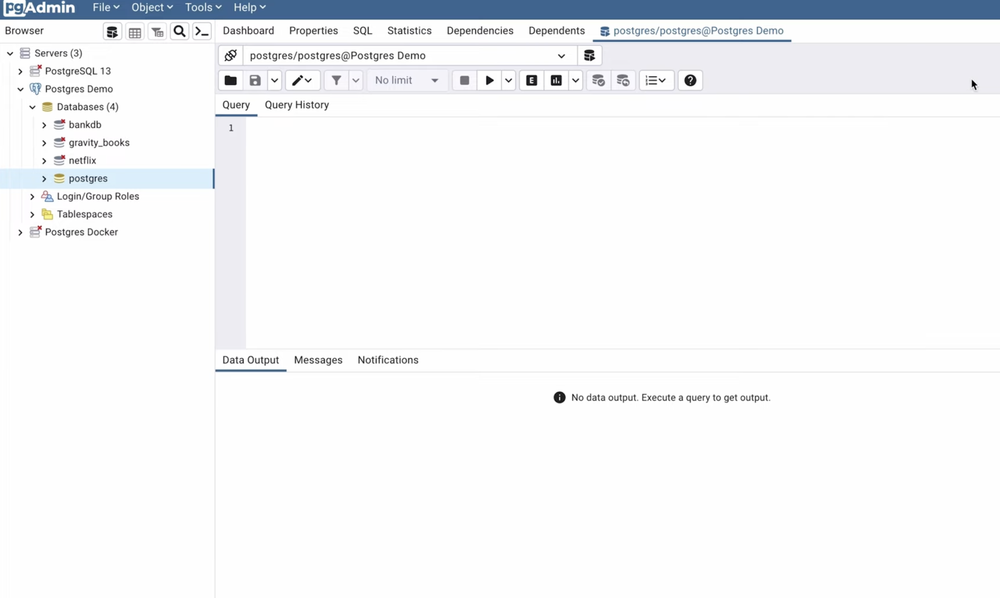
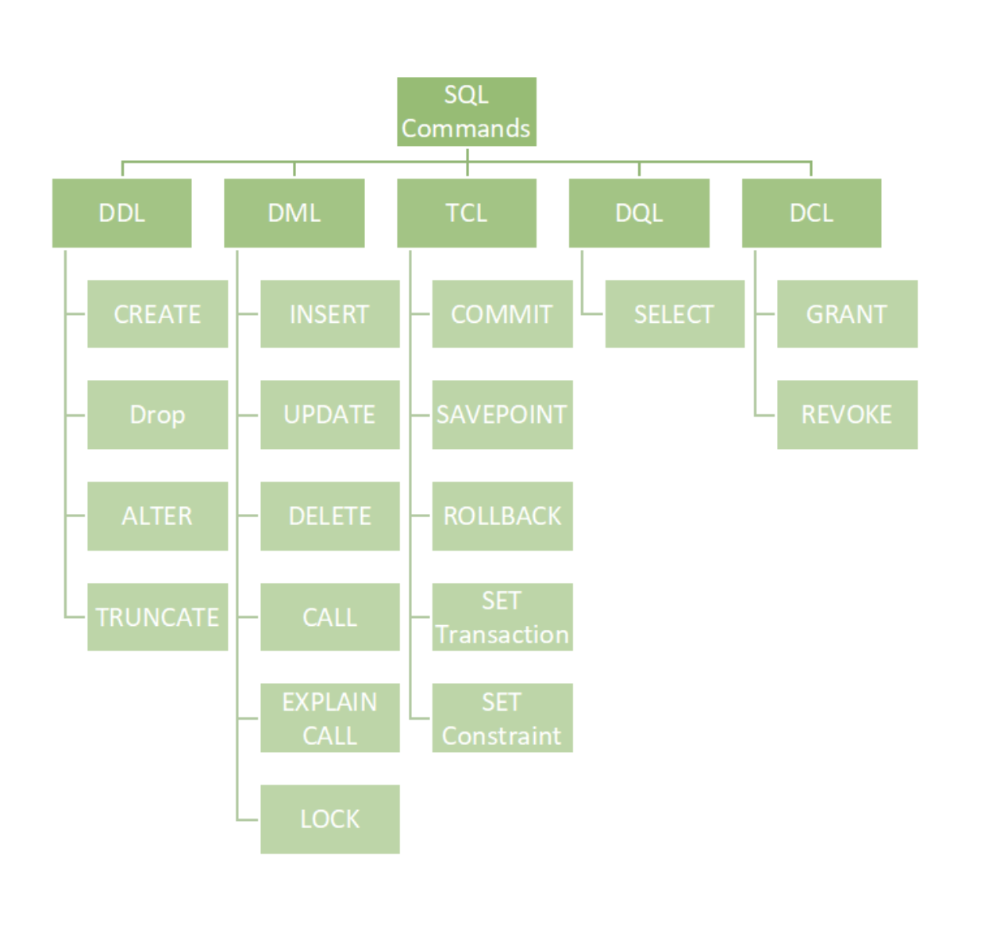
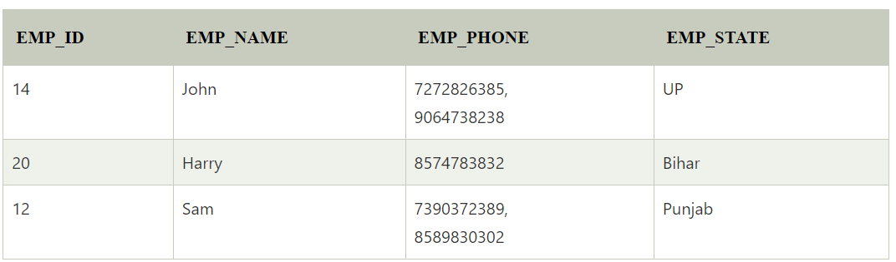
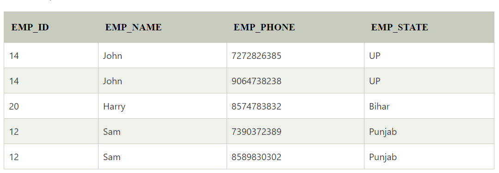
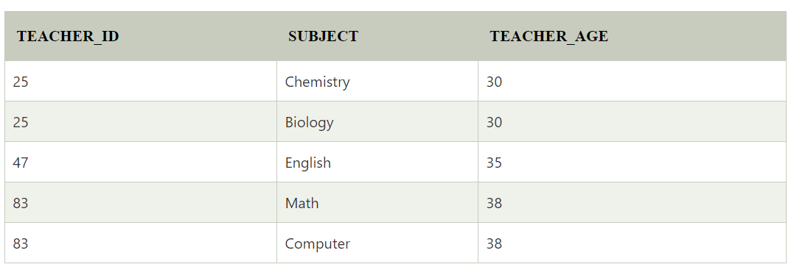
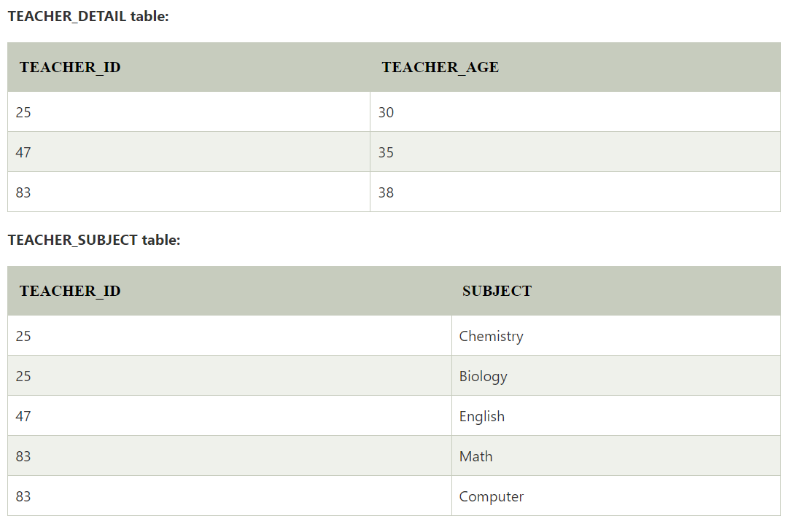
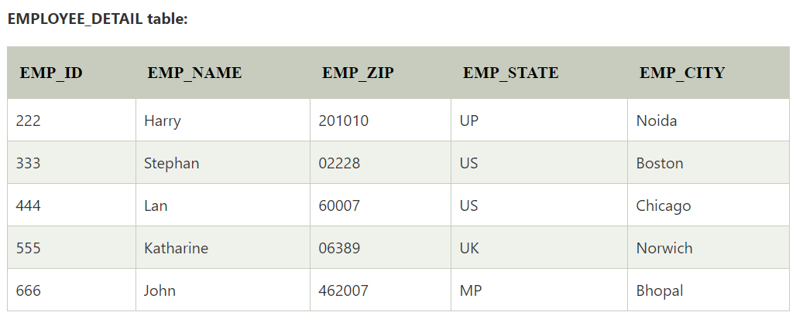
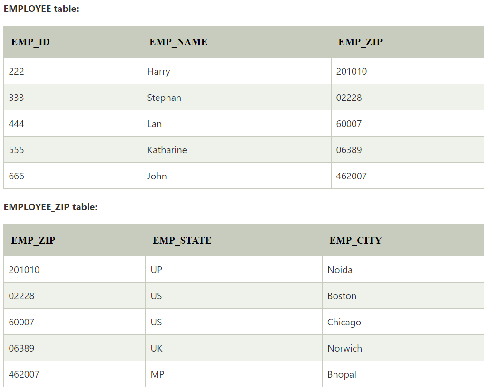

# DBMS

## What is a Database Management System (DBMS)?

* A database management system (DBMS) is a software application that allows users to create, maintain, and query databases. A database is a collection of data that is organized in a way that makes it easy to find and use.

* The DBMS provides a layer of abstraction between the data and the user. This means that the user does not need to know how the data is physically stored on the computer. The DBMS takes care of all of the details of data storage and retrieval.

## Why Use a DBMS?

There are many reasons to use a DBMS. Some of the benefits of using a DBMS include:

* Increased data security: The DBMS provides security features that help to protect the data from unauthorized access.
* Improved data integrity: The DBMS enforces data integrity constraints, which help to ensure that the data is accurate and consistent.
* Efficient data access: The DBMS provides efficient ways to access the data, which can improve the performance of applications.
* Reduced data redundancy: The DBMS can help to reduce data redundancy, which can save space and improve performance.
*Easier data administration: The DBMS provides tools that make it easier to manage the database, such as creating and maintaining tables, indexes, and views.

## Types of DBMS

There are two main types of DBMS: relational and non-relational.

1. Relational DBMS: A relational DBMS stores data in tables. Each table has a set of rows and columns. The rows represent individual records, and the columns represent the attributes of each record.
2. Non-relational DBMS: A non-relational DBMS does not store data in tables. Instead, it stores data in a variety of ways, such as key-value pairs, documents, or graphs.

### The Relational Model

The relational model is the most common type of database model. It is based on the concept of relations, which are tables that have a fixed number of columns. Each column has a unique name and can contain a single data type.

The relational model is a powerful and flexible way to store data. It is also easy to understand and use, which makes it a good choice for beginners.

### SQL

* SQL (Structured Query Language) is the standard language for accessing and manipulating data in a relational database. SQL statements are used to create, modify, and query databases.

* SQL is a relatively easy language to learn. It is also a very powerful language, which makes it a valuable tool for data analysis and manipulation.

Introduction to Database Management Systems: https://www.w3schools.com/sql/sql_intro.asp
SQL Reference: https://www.w3schools.com/sql/

### Download from here: https://www.postgresql.org/download/

### Installation Tutorial: https://www.postgresqltutorial.com/postgresql-getting-started/install-postgresql/

### PGAdmin basics: https://www.youtube.com/watch?v=WFT5MaZN6g4

### Commmands' Types

Actions/Operations in Any DB

### CRUD 
Creating/store data
Retrieve Data
Update/Modify Data
Delete data

### Normalisation

#### 1NF: Should be Atomic

#### 2NF: 1NF + No partial Dependancy

#### 3NF: 2NF + No Transitive Dependancy

